# Sensor Bar Card

[](https://github.com/hacs/integration)
[](https://github.com/TommySharpNZ/Sensor-Bar-Card/releases)
[](LICENSE)

A polished, highly configurable bar card for [Home Assistant](https://www.home-assistant.io/) Lovelace dashboards. Display any sensor as an animated, colour-coded horizontal bar.

Works great for power, temperature, humidity, battery, CO₂, water flow, and any other numeric sensor.

Clicking any bar opens the native Home Assistant entity dialog with full history, attributes, and charts.


> *My first ever Home Assistant card — please open an issue if you find bugs or have feature requests!*

---

## Features

- 🎨 **Three colour modes** — smooth gradient (with custom stop colours), severity bands, or a single fixed colour
- 📍 **Four label positions** — left, above, inside the bar, or off
- 📈 **Optional peak marker** — a subtle chevron and line marking the highest value seen this session
- 🎯 **Optional target marker** — a fixed chevron and line marking a configurable goal or threshold
- ✨ **Animated fill** — smooth bar width and colour transitions on value change
- 🖱️ **Native HA entity dialog** — click any bar to open the Home Assistant more-info popup with history
- 🔧 **Per-entity overrides** — every option can be set as a global default and overridden per entity
- 📐 **Configurable bar height** — set different heights per entity or globally
- 🔢 **Decimal places** — control how many decimal places are shown in the value
- 🔇 **Icon control** — use the entity's built-in HA icon, specify your own, or hide it entirely
- 🏷️ **Unit override** — display any unit regardless of what the sensor reports
- 🌡️ **Works with any sensor** — power, temperature, humidity, battery, CO₂, water flow, and more

---

## Installation

### HACS (Recommended)

1. Open **HACS** in Home Assistant
2. Click the three dots (⋮) in the top right → **Custom repositories**
3. Add `https://github.com/TommySharpNZ/Sensor-Bar-Card` and select **Dashboard** as the category
4. Click **Add**
5. Search for **Sensor Bar Card** and click **Download**
6. Hard refresh your browser (Ctrl+Shift+R)

### Manual

1. Download `sensor-bar-card.js` from the [latest release](https://github.com/TommySharpNZ/Sensor-Bar-Card/releases/latest)
2. Copy it to your Home Assistant `/config/www/` folder
3. Go to **Settings → Dashboards → Resources** and add:
   - URL: `/local/sensor-bar-card.js`
   - Type: `JavaScript Module`
4. Hard refresh your browser (Ctrl+Shift+R)

---

## Quick Start

```yaml
type: custom:sensor-bar-card
title: Power Usage
entities:
  - entity: sensor.kettle_power
    name: Kettle
    icon: mdi:kettle
    max: 3000
```

---

## Configuration

All options can be set at the **card level as global defaults** and overridden individually per entity.

### Card Options

| Option | Type | Default | Description |
|---|---|---|---|
| `title` | string | — | Optional title shown above the bars |
| `entities` | list | **required** | List of entities to display |
| `label_position` | string | `left` | Label position — `left` \| `above` \| `inside` \| `off` |
| `color_mode` | string | `severity` | Bar colour mode — `gradient` \| `severity` \| `single` |
| `color` | string | `#4a9eff` | Bar colour when `color_mode: single` |
| `gradient_stops` | list | green/orange/red | Custom gradient stop colours and positions — see [Gradient](#gradient) |
| `severity` | list | green/orange/red | Colour bands — see [Severity](#severity-options) |
| `animated` | boolean | `true` | Smooth bar width and colour transitions |
| `show_peak` | boolean | `false` | Show peak marker for the highest value seen this session |
| `peak_color` | string | `#888` | Colour of the peak marker |
| `target` | number | — | Fixed target marker value (same scale as `min`/`max`) |
| `target_color` | string | `#888` | Colour of the target marker |
| `decimal` | number | — | Decimal places to show in the value (e.g. `0`, `1`, `2`) |
| `min` | number | `0` | Minimum value (shown as 0% bar width) |
| `max` | number | `100` | Maximum value (shown as 100% bar width) |
| `height` | number | `38` | Bar height in pixels |
| `label_width` | number | `100` | Width of the name label column in pixels — only applies when `label_position: left` |
| `unit` | string | — | Override the unit of measurement displayed next to the value |

### Entity Options

Each item in `entities` accepts all card-level options above as overrides, plus:

| Option | Type | Description |
|---|---|---|
| `entity` | string | **Required.** The Home Assistant entity ID |
| `name` | string | Display name — defaults to the entity's friendly name |
| `icon` | string / `false` | MDI icon e.g. `mdi:thermometer`, or `false` to hide the icon entirely |

---

## Colour Modes

### `gradient`
Smoothly blends the bar colour from green → orange → red as the value rises from `min` to `max`. No extra configuration needed — or supply your own `gradient_stops` to use any colours you like.

Each stop takes a `color` (hex) and a `pos` (0–100). Stops are sorted by position automatically, and at least two are required.

```yaml
color_mode: gradient

# Optional — override the default green/orange/red
gradient_stops:
  - pos: 0
    color: '#4a9eff'
  - pos: 50
    color: '#9c27b0'
  - pos: 100
    color: '#e91e63'
```

### `severity`
Defines hard colour bands using `from` and `to` percentage values (0–100, relative to `min`/`max`):

```yaml
color_mode: severity
severity:
  - from: 0
    to: 33
    color: '#4CAF50'
  - from: 33
    to: 75
    color: '#FF9800'
  - from: 75
    to: 100
    color: '#F44336'
```

### `single`
A single fixed colour for the bar regardless of value:

```yaml
color_mode: single
color: '#4a9eff'
```

---

## Label Positions

| Value | Description |
|---|---|
| `left` | Name fixed on the left, value on the right — all bars start at the same position |
| `above` | Name on the left above the bar, value on the right above the bar |
| `inside` | Name and value rendered inside the bar — best with a taller `height` |
| `off` | No name label — value still shown on the right |

---

## Label Width

When using `label_position: left`, all name labels share a fixed-width column so the bars all start at the same horizontal position. The default width is `100px` — use `label_width` to widen it if your entity names are long, or narrow it for more compact cards. It can be set globally or overridden per entity.

```yaml
type: custom:sensor-bar-card
label_position: left
label_width: 140   # wider column for longer names
entities:
  - entity: sensor.living_room_temperature
    name: Living Room Temp
  - entity: sensor.bedroom_temperature
    name: Bedroom Temp
```

## Icons

Each bar shows an icon to the left of the label. The card resolves which icon to show in this order:

1. If `icon: false` — no icon is shown and no space is reserved
2. If `icon: mdi:something` — that icon is used
3. Otherwise — the entity's own HA icon is used automatically

```yaml
entities:
  - entity: sensor.kettle_power
    name: Kettle
    # no icon set — uses the entity's HA icon automatically

  - entity: sensor.fridge_power
    name: Fridge
    icon: mdi:fridge   # explicit override

  - entity: sensor.solar_power
    name: Solar
    icon: false        # no icon, no gap
```

---

## Peak Marker

When `show_peak: true` is set, the card tracks the highest value seen since the page was loaded and displays it as a subtle marker on the bar — a small downward chevron (▼) at the top with a vertical line through the bar. Use `peak_color` to change the marker colour.

This is useful for catching brief spikes you might otherwise miss, for example a kettle or appliance switching on momentarily.

> **Note:** The peak value resets when the page is reloaded as it is stored in memory only.

---

## Target Marker

When `target` is set to a value, a fixed marker is drawn on the bar at that position — a small upward chevron (▲) at the bottom with a vertical line through the bar. Use `target_color` to change the marker colour.

The target chevron points **up** from the bottom of the bar while the peak chevron points **down** from the top, so the two markers are always easy to tell apart at a glance.

The target value uses the same scale as `min` and `max` — so if `max: 3000` and you want a target at 2000W, set `target: 2000`.

---

## Unit Override

By default the card displays whatever unit the sensor reports. Use `unit` to override this — useful for shortening long units, normalising mixed sensors, or simply displaying something cleaner.

```yaml
entities:
  - entity: sensor.solar_power
    name: Solar
    unit: W       # override whatever HA reports
  - entity: sensor.daily_energy
    name: Today
    unit: kWh
```

---

## Clicking a Bar

Clicking anywhere on a bar row fires the native Home Assistant `hass-more-info` event for that entity, opening the standard HA popup with full history, attributes, and graphs — exactly the same as tapping an entity in any other HA card.

---

## Error Handling

If an entity ID is not found in Home Assistant (e.g. a typo or a device that's been removed), the card renders a small red error message in place of that bar rather than crashing the whole card. The other entities continue to display normally.

---

## Examples

---

### Basic — Single Sensor

The simplest possible config. One entity, default severity colour mode, label on the left.

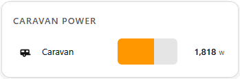

```yaml
type: custom:sensor-bar-card
title: Caravan Power
entities:
  - entity: input_number.bar_card_test_power
    name: Caravan
    icon: mdi:caravan
    max: 3000
```

---

### Colour Mode: Gradient

Smooth colour transition as the value rises from `min` to `max`. By default the gradient runs green → orange → red, but you can define your own colours and stop positions using `gradient_stops`. Each stop takes a `color` (any hex colour) and a `pos` (0–100, the percentage point where that colour is anchored).

This example uses a different custom gradient for each sensor type — cool blue for power, warm amber for temperature, ocean tones for humidity, and a traffic-light palette for battery.

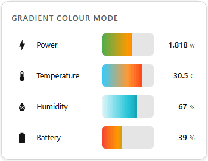

```yaml
type: custom:sensor-bar-card
title: Gradient Colour Mode
color_mode: gradient
label_position: left
entities:
  - entity: input_number.bar_card_test_power
    name: Power
    icon: mdi:lightning-bolt
    min: 0
    max: 3200
  - entity: input_number.bar_card_test_temperature
    name: Temperature
    icon: mdi:thermometer
    min: 0
    max: 40
    gradient_stops:
      - pos: 0
        color: "#33ccff"
      - pos: 50
        color: "#ff9933"
      - pos: 100
        color: "#ff0000"
  - entity: input_number.bar_card_test_humidity
    name: Humidity
    icon: mdi:water-percent
    min: 0
    max: 100
    gradient_stops:
      - pos: 0
        color: "#e0f7fa"
      - pos: 50
        color: "#26c6da"
      - pos: 100
        color: "#006064"
  - entity: input_number.bar_card_test_battery
    name: Battery
    icon: mdi:battery
    min: 0
    max: 100
    gradient_stops:
      - pos: 0
        color: "#F44336"
      - pos: 30
        color: "#FF9800"
      - pos: 60
        color: "#4CAF50"
      - pos: 100
        color: "#4CAF50"
```

---

### Colour Mode: Severity Bands

Hard colour bands that change at defined thresholds. Great for showing clearly when something is in a good, warning, or critical state.

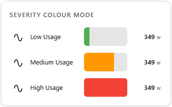

```yaml
type: custom:sensor-bar-card
title: Severity Colour Mode
color_mode: severity
label_position: left
severity:
  - from: 0
    to: 33
    color: "#4CAF50"
  - from: 33
    to: 75
    color: "#FF9800"
  - from: 75
    to: 100
    color: "#F44336"
entities:
  - entity: input_number.bar_card_test_power
    name: Low Usage
    icon: mdi:sine-wave
    max: 3000
  - entity: input_number.bar_card_test_power
    name: Medium Usage
    icon: mdi:sine-wave
    max: 500
  - entity: input_number.bar_card_test_power
    name: High Usage
    icon: mdi:sine-wave
    max: 150
```

---

### Colour Mode: Single Colour

One fixed colour for all bars regardless of value. Good for battery levels or any sensor where you just want clean consistent styling.

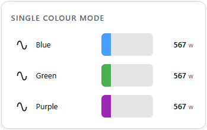

```yaml
type: custom:sensor-bar-card
title: Single Colour Mode
label_position: left
entities:
  - entity: input_number.bar_card_test_power
    name: Blue
    icon: mdi:sine-wave
    max: 3000
    color_mode: single
    color: "#4a9eff"
  - entity: input_number.bar_card_test_power
    name: Green
    icon: mdi:sine-wave
    max: 3000
    color_mode: single
    color: "#4CAF50"
  - entity: input_number.bar_card_test_power
    name: Purple
    icon: mdi:sine-wave
    max: 3000
    color_mode: single
    color: "#9c27b0"
```

---

### Label Position: Left (Default)

Name fixed-width on the left, value on the right. All bars start at the same horizontal position regardless of name length — the best choice when displaying multiple sensors together.


```yaml
type: custom:sensor-bar-card
title: Label Position — Left
label_position: left
entities:
  - entity: input_number.bar_card_test_power
    name: Caravan
    icon: mdi:caravan
    max: 3000
  - entity: input_number.bar_card_test_power
    name: Fridge
    icon: mdi:fridge
    max: 2000
  - entity: input_number.bar_card_test_power
    name: Lighting
    icon: mdi:lightbulb
    max: 1000
```

---

### Label Position: Above

Name and value shown above the bar. Good when you want more vertical breathing room between rows.

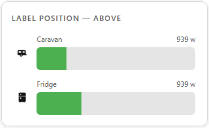

```yaml
type: custom:sensor-bar-card
title: Label Position — Above
label_position: above
entities:
  - entity: input_number.bar_card_test_power
    name: Caravan
    icon: mdi:caravan
    max: 3000
  - entity: input_number.bar_card_test_power
    name: Fridge
    icon: mdi:fridge
    max: 2000
```

---

### Label Position: Inside

Name and value rendered inside the bar itself. Works best with a taller bar height.

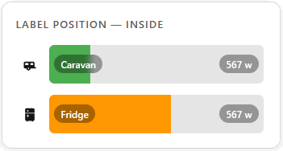

```yaml
type: custom:sensor-bar-card
title: Label Position — Inside
label_position: inside
height: 48
entities:
  - entity: input_number.bar_card_test_power
    name: Caravan
    icon: mdi:caravan
    max: 3000
  - entity: input_number.bar_card_test_power
    name: Fridge
    icon: mdi:fridge
    max: 1000
```

---

### Label Position: Off

No name label at all — value still shows on the right. Useful for very compact dashboards or when the card title is sufficient context.

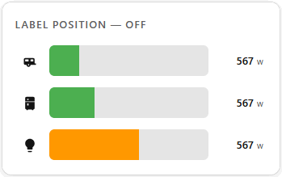

```yaml
type: custom:sensor-bar-card
title: Label Position — Off
label_position: "off"
entities:
  - entity: input_number.bar_card_test_power
    icon: mdi:caravan
    max: 3000
  - entity: input_number.bar_card_test_power
    icon: mdi:fridge
    max: 2000
  - entity: input_number.bar_card_test_power
    icon: mdi:lightbulb
    max: 1000
```

---

### Label Width

Override the default label width.

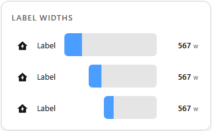

```yaml
type: custom:sensor-bar-card
title: Label Widths
label_position: left
color_mode: single
color: "#4a9eff"
max: 3000
entities:
  - entity: input_number.bar_card_test_power
    name: Label
    label_width: 35
  - entity: input_number.bar_card_test_power
    name: Label
    label_width: 75
  - entity: input_number.bar_card_test_power
    name: Label
```

---

### Peak Marker

When `show_peak: true`, a subtle chevron (▼) and vertical line marks the highest value seen since the page loaded. Use `peak_color` to choose a colour — defaults to grey.

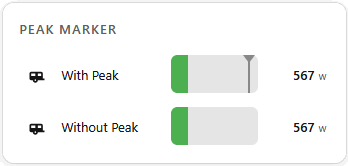

```yaml
type: custom:sensor-bar-card
title: Peak Marker
label_position: left
show_peak: true
entities:
  - entity: input_number.bar_card_test_power
    name: With Peak
    icon: mdi:caravan
    max: 3000
  - entity: input_number.bar_card_test_power
    name: Without Peak
    icon: mdi:caravan
    max: 3000
    show_peak: false
```

---

### Target Marker

A fixed marker (▲) showing a goal or threshold. The target chevron points **up** from the bottom of the bar — the opposite of the peak marker — making the two easy to distinguish. Use `target_color` to choose a colour — defaults to grey.

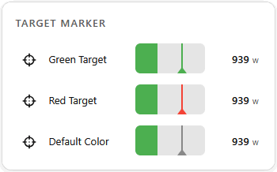

```yaml
type: custom:sensor-bar-card
title: Target Marker
label_position: left
entities:
  - entity: input_number.bar_card_test_power
    name: Green Target
    icon: mdi:target
    min: 0
    max: 3000
    target: 2000
    target_color: "#4CAF50"
  - entity: input_number.bar_card_test_power
    name: Red Target
    icon: mdi:target
    min: 0
    max: 3000
    target: 2000
    target_color: "#F44336"
  - entity: input_number.bar_card_test_power
    name: Default Color
    icon: mdi:target
    min: 0
    max: 3000
    target: 2000
```

---

### Peak & Target Together

Peak (▼ top) and target (▲ bottom) on the same bar. Peak tracks the session high while target marks your goal — both independently coloured so they're always easy to tell apart.

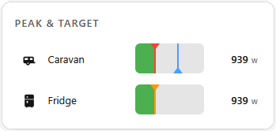

```yaml
type: custom:sensor-bar-card
title: Peak & Target
label_position: left
show_peak: true
peak_color: "#F44336"
entities:
  - entity: input_number.bar_card_test_power
    name: Caravan
    icon: mdi:caravan
    min: 0
    max: 3200
    target: 2000
    target_color: "#4a9eff"
  - entity: input_number.bar_card_test_power
    name: Fridge
    icon: mdi:fridge
    min: 0
    max: 3200
    target: 500
    target_color: "#4CAF50"
    peak_color: "#FF9800"
```

---

### Decimal Places

Control how many decimal places are shown in the value. Useful for tidying up temperature, humidity, or any sensor that reports many decimal places by default.

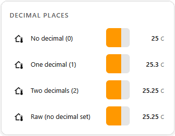

```yaml
type: custom:sensor-bar-card
title: Decimal Places
label_position: left
min: 0
max: 40
label_width: 140
entities:
  - entity: input_number.bar_card_test_temperature
    name: No decimal (0)
    decimal: 0
  - entity: input_number.bar_card_test_temperature
    name: One decimal (1)
    decimal: 1
  - entity: input_number.bar_card_test_temperature
    name: Two decimals (2)
    decimal: 2
  - entity: input_number.bar_card_test_temperature
    name: Raw (no decimal set)
```

---

### Hiding Icons

Use `icon: false` to remove the icon and its reserved space entirely. You can mix and match — some rows with icons, some without.

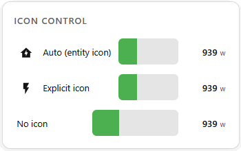

```yaml
type: custom:sensor-bar-card
title: Icon Control
label_position: left
entities:
  - entity: input_number.bar_card_test_power
    name: Auto (entity icon)
    max: 3000
  - entity: input_number.bar_card_test_power
    name: Explicit icon
    icon: mdi:flash
    max: 3000
  - entity: input_number.bar_card_test_power
    name: No icon
    icon: false
    max: 3000
```

---

### Bar Height Variations

Adjust `height` to make bars taller or more compact. Can be set globally or per entity.

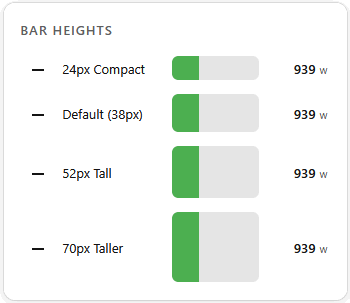

```yaml
type: custom:sensor-bar-card
title: Bar Heights
label_position: left
entities:
  - entity: input_number.bar_card_test_power
    name: 24px Compact
    icon: mdi:minus
    max: 3000
    height: 24
  - entity: input_number.bar_card_test_power
    name: Default (38px)
    icon: mdi:minus
    max: 3000
  - entity: input_number.bar_card_test_power
    name: 52px Tall
    icon: mdi:minus
    max: 3000
    height: 52
  - entity: input_number.bar_card_test_power
    name: 70px Taller
    icon: mdi:minus
    max: 3000
    height: 70
```

---

### Per-Entity Overrides

Every global option can be overridden per entity. This example uses a global gradient, but overrides the colour mode, height, and label position individually on some entities.

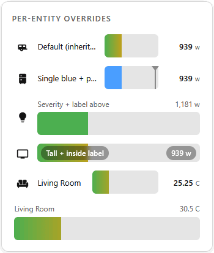

```yaml
type: custom:sensor-bar-card
title: Per-Entity Overrides
color_mode: gradient
label_position: left
animated: true
show_peak: false
entities:
  - entity: input_number.bar_card_test_power
    name: Default (inherits all globals)
    icon: mdi:caravan
    max: 3000
  - entity: input_number.bar_card_test_power
    name: Single blue + peak on
    icon: mdi:fridge
    max: 3000
    color_mode: single
    color: "#4a9eff"
    show_peak: true
  - entity: input_number.bar_card_test_power
    name: Severity + label above
    icon: mdi:lightbulb
    max: 3000
    color_mode: severity
    label_position: above
    severity:
      - from: 0
        to: 33
        color: "#4CAF50"
      - from: 33
        to: 75
        color: "#FF9800"
      - from: 75
        to: 100
        color: "#F44336"
  - entity: input_number.bar_card_test_power
    name: Tall + inside label
    icon: mdi:television
    max: 3000
    height: 30
    label_position: inside
  - entity: input_number.bar_card_test_temperature
    name: Living Room
    icon: mdi:sofa
    label_width: 80
  - entity: input_number.bar_card_test_temperature
    name: Living Room
    label_position: above
    icon: false
    label_width: 80
```

---

## Future Features

A few ideas that have been discussed and are on the roadmap — no timeline, but watch this space:

- **UI / Visual editor** — configure the card through the HA dashboard UI instead of YAML, with dropdowns, toggles, and an entity picker
- **`tap_action` / `hold_action`** — configurable actions on click, matching the standard HA action model used by other cards
- **`attribute` support** — display a specific entity attribute instead of the main state value
- **Reverse / RTL bars** — fill from right to left for sensors where low values should appear full (e.g. remaining capacity)
- **Min / max labels** — optional labels at each end of the bar track showing the configured min and max values

---

## Contributing

Pull requests and issues are welcome! Please open an issue before submitting major changes.

1. Fork the repository
2. Make your changes to `dist/sensor-bar-card.js`
3. Test in Home Assistant
4. Open a pull request

---

## License

[MIT](LICENSE)
